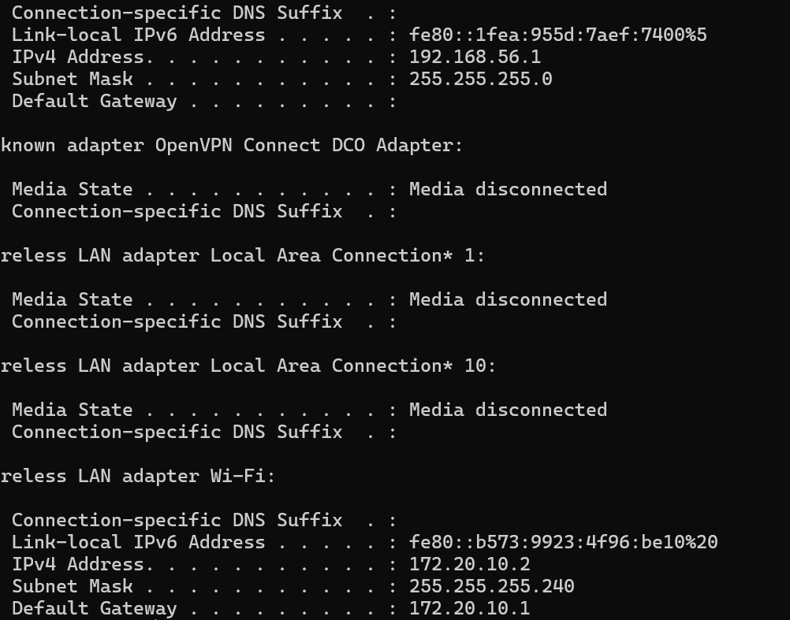
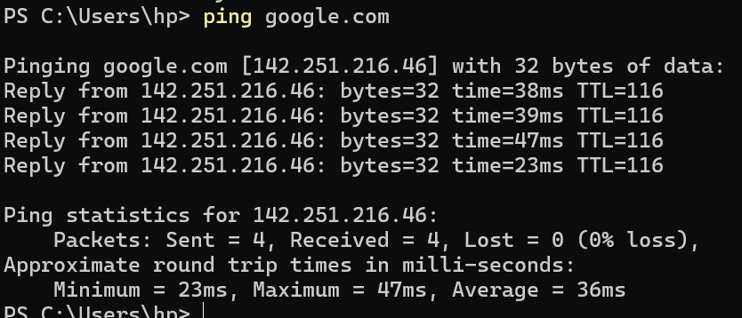
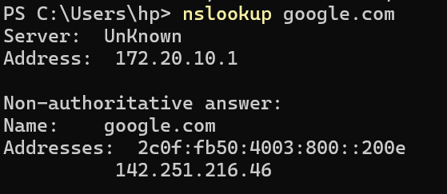
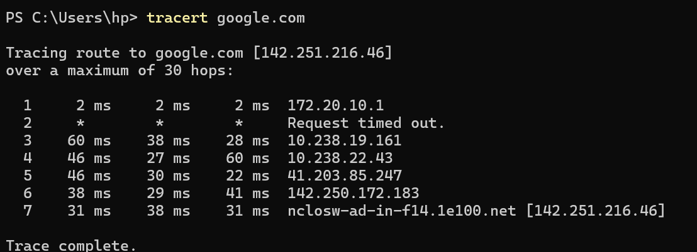
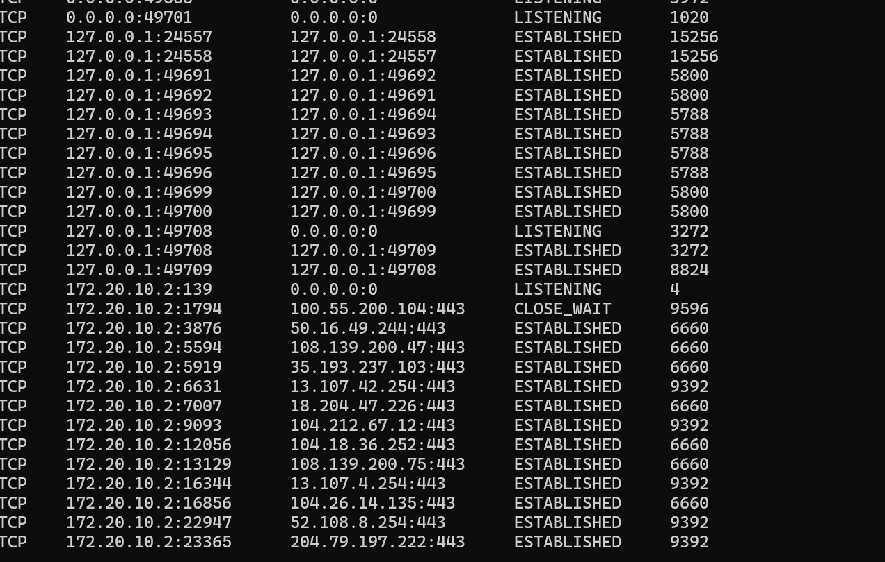
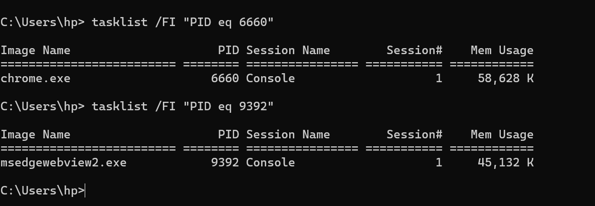
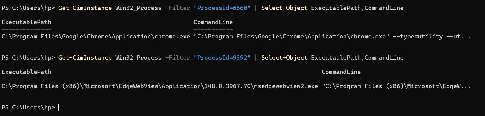
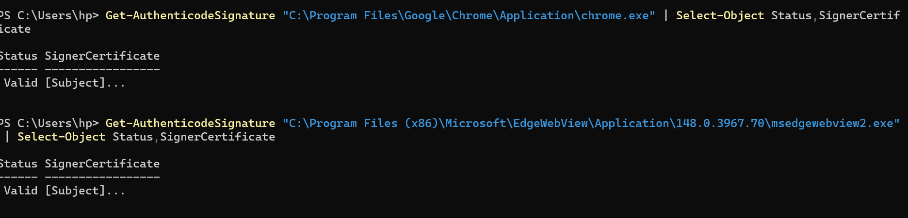

Today, I learned about the basic role of a SOC analyst and how networking knowledge is useful during security investigations. A SOC analyst monitors systems and network activity, investigates suspicious behavior, determines whether an alert is legitimate or malicious, and documents the findings.

I practiced several basic networking commands in PowerShell. I used ipconfig to view my computer's network configuration, including my IPv4 address, subnet mask, and default gateway.
I used ping google.com to test whether my computer could communicate with Google. The test was successful with no packet loss. 

I also used nslookup google.com to see how DNS converts the domain name google.com into an IP address.

I then used tracert google.com to see the different network hops that traffic passed through before reaching Google. This helped me understand that network traffic usually passes through several devices before reaching its final destination.

For the hands-on investigation, I used netstat -ano to view active network connections on my computer.
I selected one established connection using port 443 and PID 6660. Since port 443 is commonly used for HTTPS traffic, I wanted to identify which application was responsible for the connection.

I used tasklist to investigate PID 6660 and discovered that it belonged to chrome.exe.

I then used PowerShell to check the executable path and confirmed that Chrome was running from its normal installation directory. I also checked its digital signature using Get-AuthenticodeSignature, and the result was Valid.

Based on the information collected, I concluded that the connection was legitimate Chrome HTTPS traffic and did not appear suspicious.

The main thing I learned from this exercise is that a SOC analyst should investigate before making a conclusion. I followed the process:

Network connection → PID → Process → Executable location → Digital signature → Conclusion.

I also saved screenshots of the commands and investigation results as evidence of the practical work I completed.
